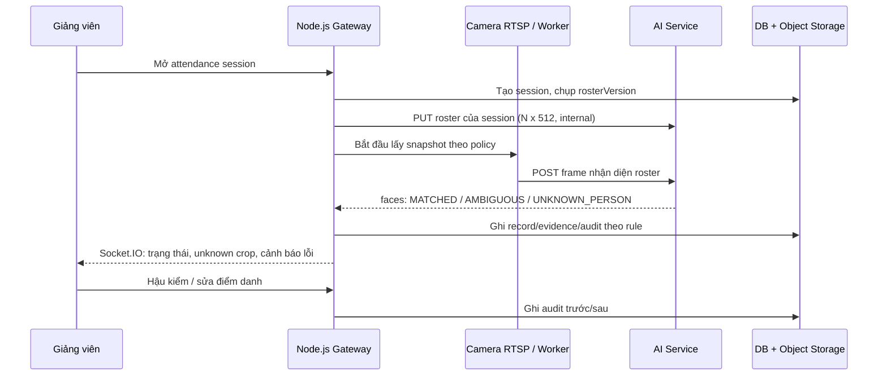

# AI ↔ Backend: phạm vi MVP và hợp đồng tích hợp

**Trạng thái:** đề xuất để Backend review trước khi triển khai.
**Phạm vi:** một camera RTSP cho một lớp học phần. Tài liệu này bổ sung và ưu tiên hơn phần AI trong `docs/api_documentation.md` khi hai tài liệu mâu thuẫn.

---

## 1. Kết luận ngắn

Danh sách chức năng hiện có là **roadmap sản phẩm**, chưa phải MVP. Nếu làm toàn bộ ngay (eKYC lại, đơn nghỉ, export PDF, dashboard đầy đủ, queue nhiều phòng, monitoring hành vi...) thì chậm và khó kiểm thử.

MVP cần chứng minh đúng một việc:

> Giảng viên mở phiên của đúng lớp. Hệ thống lấy ảnh từ camera, chỉ so khớp với roster lớp đó, ghi nhận kết quả có bằng chứng; giảng viên có quyền hậu kiểm và sửa có audit log.

Không đưa vào MVP:

- Nhận diện người lạ là ai trong toàn trường.
- Liveness/re-eKYC phức tạp, phát hiện ngủ/gọi điện thoại, giám sát hành vi liên tục.
- Tự động kết luận vắng chỉ vì AI chưa thấy mặt trong một ảnh.
- Luồng RTSP trực tiếp ra trình duyệt hoặc trả RTSP credential cho Frontend.
- Queue, scale 100 phòng, load test lớn. Đây là giai đoạn production sau khi một camera chạy ổn.

## 2. Luồng nhận diện bắt buộc: roster-scoped cosine

Ví dụ lớp A có roster `SV001`, `SV002`, `SV003`:

```text
Roster lớp A (chỉ sinh viên đang học lớp A)
        ↓
Embedding đã chuẩn hóa của roster: M ∈ R^(N × 512)
        ↓
Ảnh camera RTSP → detect face → quality check → embedding v ∈ R^512
        ↓
score = M @ v  (cosine similarity vì M và v đã L2-normalize)
        ↓
max score + score hạng hai
        ↓
MATCHED | AMBIGUOUS | UNKNOWN_PERSON
```

Quy tắc:

1. AI chỉ nạp embedding của sinh viên thuộc `courseClassId` của phiên hiện tại. Không quét toàn bộ kho sinh viên để tìm tên người lạ.
2. `score >= acceptThreshold` **và** `score - runnerUpScore >= ambiguityMargin` mới trả `MATCHED`.
3. Không đủ ngưỡng trả `UNKNOWN_PERSON`; quá sát hạng hai trả `AMBIGUOUS`. Cả hai không tạo điểm danh cho sinh viên nào.
4. Một sinh viên xuất hiện nhiều lần trong một frame chỉ giữ kết quả có `score` cao nhất. Một nhận diện yếu không được ghi đè kết quả tốt hơn trước đó.
5. `acceptThreshold`, `ambiguityMargin`, số frame đồng thuận phải cấu hình ở Gateway/AI, không fix cứng vào Frontend. Giá trị khởi tạo phải được hiệu chỉnh bằng tập validation của model; `0.60` trong tài liệu cũ chỉ là mốc thử nghiệm, không phải ngưỡng production.
6. So khớp toàn trường chỉ dùng khi **đăng ký khuôn mặt** để chống một mặt đăng ký cho hai tài khoản. So khớp điểm danh luôn giới hạn trong roster lớp.

### Sơ đồ trách nhiệm



## 3. Quy tắc phiên điểm danh MVP

### 3.1 Phiên học

- Scheduler có thể tạo `PLANNED` session theo lịch, nhưng **không tự chốt điểm danh** khi đến giờ. Lý do: giảng viên có thể nghỉ, đến muộn hoặc đổi phòng.
- Giảng viên của lớp mở session thành `LIVE`; Gateway kiểm tra quyền sở hữu lớp, lịch và camera trước khi gọi AI.
- Trong cửa sổ đầu buổi (mặc định 15 phút, cấu hình được), worker lấy frame định kỳ. Không cần xử lý mọi frame video: với một camera MVP, lấy 1 frame/giây và bỏ frame cũ khi AI bận để tránh queue stale.
- Gateway ghi `firstSeenAt`, `bestScore`, evidence crop tốt nhất. Gateway, không phải AI, áp dụng rule Đi học/Muộn/Vắng/Có phép.
- Trước khi kết thúc, giảng viên xem danh sách, unknown crops và sửa thủ công. Kết thúc sớm phải cảnh báo khi còn cách giờ kết thúc lịch quá xa; policy có thể mở nút kết thúc trước 30 phút.

### 3.2 Trạng thái điểm danh

| Trạng thái | Chủ thể quyết định | Quy tắc MVP |
|---|---|---|
| `UNCONFIRMED` | Gateway | Mặc định khi session bắt đầu; chưa phải vắng. |
| `PRESENT` | Gateway | Có nhận diện hợp lệ trong thời hạn đúng giờ. |
| `LATE` | Gateway | Có nhận diện hợp lệ sau `lateCutoffMinutes`; giá trị cutoff do trường cấu hình. |
| `ABSENT` | Gateway/giảng viên | Chỉ chốt khi kết thúc phiên và hậu kiểm, không do AI tự suy ra từ một frame thiếu mặt. |
| `EXCUSED` | Gateway/giảng viên | Có đơn nghỉ đã duyệt; ghi đè theo policy. |

`UNKNOWN_PERSON` và `AMBIGUOUS` là **kết quả quan sát của AI**, không phải trạng thái điểm danh.

### 3.3 Retry và cảnh báo

- Camera lỗi: retry giới hạn, đánh dấu session `DEGRADED`, gửi một cảnh báo cho giảng viên/admin, không spam theo từng frame.
- AI timeout/`5xx`: retry theo backoff ngắn; nếu hết retry, giữ dữ liệu đã ghi và để giảng viên chụp lại/hậu kiểm.
- Mọi command capture cần `requestId` hoặc idempotency key để retry không tạo evidence/record trùng.

## 4. Phân công ranh giới

### Node.js Gateway sở hữu

- RBAC, xác thực, kiểm tra giảng viên có quyền với lớp/phiên.
- Lịch học, camera binding, tạo/mở/kết thúc `attendance_session`.
- Roster, rule đúng giờ/muộn/vắng/có phép, persistence, audit log và Socket.IO.
- Retry camera/AI, URL evidence có phân quyền, retention và object storage.
- Mapping `studentId` sang tên/mã sinh viên để hiển thị.

### AI Service sở hữu

- Face detection, quality check, tạo embedding 512D, cosine với roster đã nạp.
- Kiểm tra trùng khuôn mặt khi enrollment (global duplicate check nội bộ).
- Trả bbox, quality, score, kết quả và crop bằng chứng. Không ghi DB attendance, không tự tính vắng/muộn, không cấp quyền.

### Frontend không được làm

- Không gọi Python AI trực tiếp.
- Không nhận RTSP credential, embedding 512D hoặc danh tính toàn trường.
- Không tự tính trạng thái điểm danh từ score.

## 5. Endpoint đề nghị

`/api/v1` là API public qua Gateway. `/internal/v1` chỉ Gateway/worker gọi AI qua network private và service authentication. Không expose internal endpoint ra Internet hay Frontend.

### 5.1 Gateway public: phải có cho MVP

| Endpoint | Vai trò | Mục đích |
|---|---|---|
| `POST /api/v1/ekyc/enroll-initial` | STUDENT | Nhận video/frames enrollment; Gateway orchestration với AI, chống duplicate toàn trường, lưu avatar/evidence. |
| `POST /api/v1/ekyc/pose` | STUDENT | Nhận một frame camera và trả pose hiện tại (`front`, `left`, `right`, `unknown`) để Frontend điều hướng enrollment theo thời gian thực. |
| `GET /api/v1/auth/me` | authenticated | Trả thông tin phiên và user cơ bản; không dùng để tải toàn bộ dữ liệu của các tab. |
| `GET /api/v1/student/biometric-profile` | STUDENT | Trả metadata định danh của chính sinh viên đang đăng nhập; không trả embedding thô hoặc storage path. |
| `GET /api/v1/student/face-preview` | STUDENT | Trả ảnh enrollment của chính sinh viên dưới dạng binary, kiểm quyền bằng JWT. |
| `GET /api/v1/admin/biometrics` | ADMIN | Danh sách có phân trang/filter. |
| `GET /api/v1/admin/biometrics/:userId` | ADMIN | Chi tiết enrollment, preview được ủy quyền. |
| `POST /api/v1/admin/biometrics/:userId/reset` | ADMIN | Reset enrollment có lý do + audit; Gateway mới gọi AI xoá vector. |
| `GET /api/v1/teacher/sessions/:id` | TEACHER | Session, roster, counts, camera/AI health, evidence metadata. |
| `POST /api/v1/teacher/sessions/:id/start` | TEACHER | Chuyển `PLANNED` sang `LIVE`, validate teacher/lịch/camera, nạp roster vào AI. |
| `POST /api/v1/teacher/sessions/:id/trigger-snapshot` | TEACHER | Yêu cầu worker lấy một ảnh RTSP, xử lý AI; không nhận RTSP URL từ client. |
| `PUT /api/v1/teacher/sessions/:id/attendance/:studentId/override` | TEACHER | Sửa trạng thái bắt buộc `newStatus`, `reason`; ghi audit trước/sau. |
| `POST /api/v1/teacher/sessions/:id/end` | TEACHER | Hậu kiểm, chốt records; cảnh báo/confirm khi kết thúc quá sớm. |
| `GET /api/v1/student/attendance-history` | STUDENT | Chỉ lịch sử của chính sinh viên, filter môn/buổi/ngày, có evidence URL có hạn. |

### 5.1.1 Tách endpoint theo chức năng sinh viên

Frontend không gom toàn bộ dữ liệu vào `/auth/me` hoặc một endpoint dashboard. Mỗi chức năng gọi đúng endpoint của mình; metadata định danh được hiển thị ngay bên dưới trạng thái đăng ký sau khi enrollment thành công:

| Tab | Endpoint | Dữ liệu trả về |
|---|---|---|
| Trang chủ | `GET /api/v1/student/dashboard?weekStart=YYYY-MM-DD` | Thống kê chuyên cần và lịch học tuần. |
| Lịch sử điểm danh | `GET /api/v1/student/attendance-history?search=...` | Bản ghi điểm danh và evidence đã được giới hạn theo sinh viên. |
| Đăng ký khuôn mặt sau khi hoàn tất | `GET /api/v1/student/biometric-profile` | Trạng thái, mã vector, model, kích thước vector và ngày enrollment của chính sinh viên. |
| Ảnh định danh sau khi hoàn tất | `GET /api/v1/student/face-preview` | Binary ảnh enrollment; không nhúng base64 vào dashboard/profile response. |
| Đơn nghỉ | `GET/POST /api/v1/student/leave-requests` | Danh sách và tạo đơn của chính sinh viên. |

Router student không nhận `userId` từ client; mọi endpoint lấy `req.user.userId` từ JWT. Vì vậy sinh viên không thể đổi path để đọc hồ sơ hoặc ảnh của tài khoản khác.

Giữ `trigger-snapshot` theo tên tài liệu hiện hữu để giảm thay đổi Frontend. `start` và `end` bổ sung rõ lifecycle hiện đang thiếu.

`POST /api/v1/ekyc/pose` nhận `multipart/form-data` với field `frame`. Gateway chuyển tiếp frame tới AI và trả envelope chuẩn:

```json
{
  "success": true,
  "data": {
    "pose": "front",
    "confidence": 0.91,
    "faceCount": 1,
    "bbox": { "x": 120, "y": 80, "width": 220, "height": 240 }
  }
}
```

Frontend dùng sequence `front -> left -> right -> front`, yêu cầu 2 frame hợp lệ cho mỗi pose. Frame không có mặt, có nhiều mặt, sai hướng hoặc confidence thấp chỉ được dùng để cập nhật hướng dẫn; không được gửi vào enrollment. Sau khi đủ frame, Frontend gọi `POST /api/v1/ekyc/enroll-initial` một lần.

### 5.2 Gateway public: cần cho quản lý nhưng không chặn demo AI

- CRUD user, khoa, môn, lớp học phần, roster sinh viên, lịch, phòng và camera.
- Import Excel: upload, preview, validate từng dòng, chỉ commit khi admin xác nhận; transaction rollback khi lỗi; audit import.
- Reset password, refresh token, rate limit login, audit log, health dashboard.
- `GET /api/v1/teacher/schedule` hiện backend dùng `startDate`/`endDate`; cần chốt tài liệu theo contract thực tế, không duy trì song song `week/year` vô thời hạn.

### 5.3 AI internal: hợp đồng tối thiểu, gộp endpoint để giảm round-trip

Tài liệu cũ chia `/api/face-pose`, `/api/check-enrollment`, `/api/enroll`, `/api/recognize`. Để MVP dễ vận hành, Gateway chỉ cần gọi các endpoint internal sau:

| Endpoint | Mục đích | Ghi chú |
|---|---|---|
| `GET /health` | readiness model + storage | Không public qua Frontend. |
| `POST /internal/v1/pose` | Phân loại pose của một frame | Gateway gọi server-to-server trong lúc enrollment; trả `pose`, `confidence`, `faceCount`, `bbox`, không ghi DB. |
| `POST /internal/v1/enrollments` | validate quality/pose, duplicate check, sinh embedding, trả avatar crop/vector reference | Gộp ba bước enrollment cũ. |
| `DELETE /internal/v1/enrollments/:studentId` | Xóa vector sau khi Gateway đã authorize reset | Idempotent. |
| `PUT /internal/v1/attendance-sessions/:sessionId/roster` | Nạp/cập nhật roster version, matrix `N × 512` | Chỉ server-to-server. |
| `POST /internal/v1/attendance-sessions/:sessionId/recognitions` | Nhận một frame và trả faces đã so khớp roster | Không global-search. |
| `DELETE /internal/v1/attendance-sessions/:sessionId/roster` | Xóa cache roster khi end/failed | Idempotent. |

Các endpoint cũ có thể giữ private để debug/migration, nhưng **không nên là contract Gateway chính**. Đặc biệt không dùng `/api/recognize` thiếu `sessionId`/roster context vì dễ vô tình tìm toàn trường.

### 5.4 Request/response AI quan trọng

`PUT /internal/v1/attendance-sessions/{sessionId}/roster`

```json
{
  "rosterVersion": "2026-08-29T10:00:00Z",
  "embeddingDimension": 512,
  "members": [
    { "studentId": "SV001", "embedding": [0.012, -0.034] }
  ],
  "policy": { "acceptThreshold": 0.0, "ambiguityMargin": 0.0 }
}
```

`POST /internal/v1/attendance-sessions/{sessionId}/recognitions` trả:

```json
{
  "frameId": "uuid",
  "rosterVersion": "2026-08-29T10:00:00Z",
  "faces": [
    {
      "bbox": { "x": 120, "y": 80, "width": 96, "height": 96 },
      "quality": 0.91,
      "result": "MATCHED",
      "studentId": "SV001",
      "score": 0.73,
      "runnerUpScore": 0.42,
      "evidenceCrop": "base64-or-object-key"
    },
    {
      "bbox": { "x": 260, "y": 90, "width": 88, "height": 88 },
      "quality": 0.87,
      "result": "UNKNOWN_PERSON",
      "evidenceCrop": "base64-or-object-key"
    }
  ]
}
```

Quy ước bắt buộc:

- `studentId` chỉ xuất hiện khi `result = MATCHED`; AI không đoán danh tính cho `UNKNOWN_PERSON`.
- Không gửi full embedding xuống client. Gateway có thể gửi embedding cho AI internal hoặc dùng vector store private, nhưng log phải che dữ liệu này.
- `evidenceCrop` ưu tiên upload object storage qua Gateway/worker rồi trả `evidenceId`/object key; Base64 chỉ phù hợp demo một camera.
- Lỗi phải dùng HTTP chuẩn: `400/422` input invalid, `401/403` service/RBAC, `409` roster version/session conflict, `429` AI busy, `502/503` upstream unavailable. Response lỗi thống nhất: `{ "error": { "code", "message", "requestId" } }`.

## 6. Dữ liệu tối thiểu: sửa trên schema hiện có

Không tạo song song `FaceEnrollment`, `AttendanceSession` hay `AttendanceRecord`. Schema hiện có đã dùng đúng khái niệm tương ứng: `UserBiometric`, `ClassSession`, `AttendanceLog`, `SessionProofSnapshot`, `SystemAuditLog`. BE cần mở rộng có kiểm soát thay vì tạo entity trùng nghĩa.

| Model hiện có | Sửa/bổ sung cần thiết | Lý do |
|---|---|---|
| `UserBiometric` | Giữ `faissVectorId`, thêm `modelVersion`, `embeddingDimension`, `enrollmentVersion`; cập nhật `enrolledFaceUrl`, `lastEnrolledAt` sau enrollment thành công. | Theo dõi đúng model/vector đang dùng, không lộ embedding ra client. |
| `ClassSession` | Thêm `startedAt`, `endedAt`, `rosterVersion`, `failureReason`; bổ sung lifecycle `SCHEDULED → LIVE_NOW → REVIEW → COMPLETED`, và trạng thái lỗi/degraded nếu enum chưa có. | Tách giờ lịch khỏi giờ thực tế giảng viên mở/kết thúc. |
| `AttendanceLog` | Đổi default từ `ABSENT` sang `UNCONFIRMED`; thêm `firstSeenAt`, `bestScore`, `bestEvidenceId` hoặc link evidence tương đương. | Không được đánh dấu vắng ngay khi tạo session. |
| `SessionProofSnapshot` | Giữ cho evidence đã match sinh viên. Không dùng model này để lưu unknown vì `studentId` đang bắt buộc. | Unknown không có studentId hợp lệ. |
| **Model mới** `SessionFaceDetection` | `sessionId`, `studentId?`, `result`, `score?`, `runnerUpScore?`, `quality?`, `boundingBox`, `imageUrl`, `frameId`, `capturedAt`. | Lưu `UNKNOWN_PERSON`/`AMBIGUOUS` cùng face crop, không tạo user/attendance giả. |
| `SystemAuditLog` | Dùng luôn cho start/end session, reset face, override và import; before/after + reason + requestId. | Không tạo audit table mới. |

DB constraint bắt buộc: giữ unique `AttendanceLog(sessionId, studentId)` hiện có; một `UserBiometric` active cho một user. Duplicate face giữa hai user phải được AI báo về, Gateway trả `409 Conflict` và rollback transaction.

## 7. Phân kỳ thực tế

### Bắt buộc để demo MVP đúng

1. Auth/RBAC, CRUD tối thiểu lớp học phần/roster/lịch/phòng/camera.
2. Enrollment một lần, duplicate check, reset admin có audit.
3. Teacher start/end session, snapshot RTSP, nạp roster matrix và recognition theo roster.
4. Window nhận diện đầu buổi, `UNCONFIRMED/PRESENT/LATE/ABSENT/EXCUSED`, evidence crop.
5. Unknown/ambiguous panel cho giảng viên, manual override có reason/audit.
6. Student xem lịch sử của chính mình và crop evidence có quyền truy cập.
7. Camera/AI health, retry giới hạn, thông báo lỗi cho giảng viên.

### Làm sau MVP (P1)

- Excel import preview/validate/transaction/audit; cần sớm nếu team cần nạp data demo lớn.
- Dashboard/report theo lớp/môn/kỳ, export Excel.
- Đơn nghỉ và giảng viên duyệt; notification in-app cơ bản.
- Snapshot đối soát định kỳ sau giờ nghỉ, tối đa một camera/lớp trước.
- Refresh token, password reset, object storage thật, backup/restore DB, integration/E2E tests.

### Giai đoạn production, không đưa vào sprint MVP

- Re-eKYC/liveness mạnh, cảnh báo hết hạn enrollment.
- PDF export, retention configuration UI, advanced monitoring/logging.
- Queue/background worker và scale multi-camera/multi-room; khi áp dụng phải drop frame stale thay vì xếp hàng video cũ.
- Load test 100 phòng, autoscaling GPU/AI worker.
- Nhận diện hành vi ngủ/gọi điện thoại. Đây là bài toán computer vision khác, rủi ro quyền riêng tư cao, không phải điểm danh.

## 8. Acceptance criteria cho BE + AI

1. Giảng viên không thuộc lớp gọi `start`, `capture`, `override`, `end` nhận `403`.
2. Một face không thuộc roster luôn trả `UNKNOWN_PERSON` hoặc `AMBIGUOUS`, không tạo/đổi record của sinh viên lớp.
3. Cùng face không thể active enrollment cho hai user; Gateway trả `409` và không ghi nửa chừng.
4. Retry cùng `requestId` không tạo attendance/evidence/audit trùng.
5. AI hết sẵn sàng/camera lỗi không tự đánh dấu cả lớp vắng; session ghi `DEGRADED` để giảng viên hậu kiểm.
6. Student chỉ xem attendance/evidence của mình; teacher chỉ xem lớp phụ trách; admin có quyền reset và audit.
7. `end` chốt `ABSENT` chỉ sau rule/session review, chưa có mặt trong một frame không đồng nghĩa `ABSENT`.

## 9. Điểm cần BE chốt trước khi code

1. Chọn một contract lịch dạy: hiện backend `startDate/endDate`; cập nhật docs, không tạo hai API song song.
2. Chốt `lateCutoffMinutes`, số frame đồng thuận, `acceptThreshold`, `ambiguityMargin` bằng config server-side và test set; không hard-code ở UI.
3. Chọn nơi giữ vector: AI service/vector store private hoặc Gateway truyền roster internal. Dù chọn cách nào, Frontend không thấy vector.
4. Chọn object storage cho evidence. Local disk chỉ dùng demo, không dùng production.
5. Chốt session lifecycle: `PLANNED → LIVE → REVIEW → FINALIZED` và xử lý `DEGRADED/FAILED`.

---

## 10. Lộ trình endpoint tối thiểu theo thứ tự

1. `POST /api/v1/ekyc/enroll-initial`, `GET /api/v1/admin/biometrics/:userId`, `POST /api/v1/admin/biometrics/:userId/reset`.
2. `GET /api/v1/teacher/sessions/:id`, `POST /start`, `POST /trigger-snapshot`, `PUT /attendance/:studentId/override`, `POST /end`.
3. AI internal roster cache + recognition endpoint theo `sessionId`.
4. `GET /api/v1/student/attendance-history` + evidence authorization.
5. Socket.IO từ Gateway: session status, recognition update, unknown alert, health alert.

Sau năm bước này, hệ thống đạt MVP điểm danh có AI. Các module còn lại không được chặn việc demo và đo chất lượng nhận diện.

---

## 11. Bản đồ sửa code để BE review và merge

Phần này đối chiếu trực tiếp với code hiện có. Nó là checklist thay đổi, **không phải yêu cầu sửa toàn bộ backend trong một PR**.

### 11.1 Giữ nguyên, chỉ dùng lại

| File hiện có | Giữ nguyên vì |
|---|---|
| `backend/src/middlewares/auth.middlewares.ts` | Đã có `verifyToken` và `authorizeRoles`; route mới phải dùng lại hai middleware này. |
| `backend/src/routes/auth.routes.ts` | Giữ `/login`, `/refresh`, `/me`; sau eKYC chỉ cần service cập nhật dữ liệu để `/me` trả enrollment/avatar mới. |
| `backend/src/routes/admin.routes.ts` | Đã chặn `ADMIN` ở router-level; thêm biometric detail/reset vào đây. |
| `backend/src/routes/teacher.routes.ts` | Đã chặn `TEACHER`/`ADMIN`; thêm session lifecycle vào đây hoặc tách router con nhưng không bỏ guard. |
| `backend/prisma/schema.prisma` | Đã có `ClassSession`, `AttendanceLog`, `UserBiometric`, `SessionProofSnapshot`, `SystemAuditLog`; mở rộng các model này, không tạo bản sao tên khác. |

### 11.2 File cần sửa theo từng nhóm

| Nhóm | File sửa/tạo | Thay đổi tối thiểu | Reviewer kiểm tra |
|---|---|---|---|
| Prisma | `backend/prisma/schema.prisma` | Sửa enum/session fields ở mục 6; thêm `SessionFaceDetection` để lưu unknown/ambiguous. | Migration chạy được trên Postgres mới; existing relations không gãy. |
| Prisma | `backend/prisma/migrations/<timestamp>_attendance_mvp/migration.sql` | Migration sinh từ schema, không sửa DB thủ công trên môi trường chung. | Có rollback plan/backup trước deploy. |
| AI client | **Tạo** `backend/src/services/ai-client.service.ts` | Một lớp gọi HTTP internal đến AI: health, enroll, reset, load roster, recognize, unload roster. Timeout, requestId, error mapping `502/503`; tuyệt đối không trả credential/vector ra response. | Không có gọi AI từ controller/frontend; URL/token nằm env. |
| eKYC | **Tạo** `backend/src/routes/ekyc.routes.ts`, `controllers/ekyc.controller.ts`, `services/ekyc.service.ts` | `POST /api/v1/ekyc/enroll-initial`: validate file, gọi AI enrollment, cập nhật `User.isFaceEnrolled` + `UserBiometric` trong transaction. | STUDENT chỉ enroll chính mình; duplicate trả `409`; lỗi AI không update nửa chừng. |
| Mount eKYC | `backend/src/app.ts` | Mount `app.use('/api/v1/ekyc', ekycRoutes)`. | Route 404 cũ phải thành route có RBAC. |
| Biometric admin | `backend/src/routes/admin.routes.ts`, `controllers/biometric.controller.ts`, `services/biometric.service.ts` | Thêm `GET /biometrics/:userId`, `POST /biometrics/:userId/reset`; reset gọi AI delete sau authorization và ghi `SystemAuditLog`. | Chỉ ADMIN; userId không tồn tại là `404`; reset idempotent. |
| Teacher sessions | `backend/src/routes/teacher.routes.ts`, **tạo** `controllers/teacher-session.controller.ts`, `services/teacher-session.service.ts` | Thêm `GET /sessions/:id`, `POST /sessions/:id/start`, `POST /sessions/:id/trigger-snapshot`, `PUT /sessions/:id/attendance/:studentId/override`, `POST /sessions/:id/end`. | Kiểm tra `courseClass.teacherId === req.user.userId` trước mọi thay đổi; ADMIN override chỉ khi policy cho phép. |
| Camera worker | **Tạo** `backend/src/services/camera-capture.service.ts` | Worker/server-side đọc RTSP, lấy một frame và gửi AI; frontend chỉ nhận URL evidence/Socket event. | Không lộ RTSP URL/password qua JSON/WebSocket; timeout/retry/drop stale frame. |
| Attendance rules | `backend/src/services/teacher-session.service.ts` | Một hàm xử lý AI result: upsert `AttendanceLog`, chọn best score/evidence, không cho unknown tạo record, chốt absent lúc end/review. | Unique `(sessionId, studentId)` không bị lỗi khi retry. |
| Evidence | `backend/src/services/evidence.service.ts` hoặc service storage hiện có | Upload crop vào object storage, lưu `imageUrl`/key. Local disk chỉ demo. | Student chỉ đọc evidence của mình; teacher chỉ lớp mình. |
| Realtime | `backend/src/server.ts` hoặc **tạo** `backend/src/realtime/socket.ts` | Gateway phát Socket.IO sau khi DB commit: session status, face detection, unknown alert, health alert. | AI không phát socket trực tiếp; room theo `sessionId` + authorization. |
| Student history | **Tạo** `backend/src/routes/student.routes.ts`, `controllers/student.controller.ts`, `services/student.service.ts`; sửa `app.ts` | `GET /api/v1/student/attendance-history`, lọc theo `req.user.userId`. | Không truyền `studentId` tùy ý từ query/body. |
| Tài liệu | `docs/api_documentation.md`, `docs/backend_missing_features.md`, tài liệu này | Đồng bộ endpoint, xoá mô tả AI global recognition, đánh dấu route có/chưa có. | Không để hai contract lịch hoặc AI trái nhau. |

### 11.3 Các sửa cụ thể trong schema trước khi viết service

1. `AttendanceStatus` trong `backend/prisma/schema.prisma`: thêm `UNCONFIRMED` nếu chưa có; đổi default `AttendanceLog.status` thành `UNCONFIRMED`.
2. `SessionStatus`: giữ trạng thái hiện dùng, bổ sung `REVIEW` và một trạng thái lỗi/degraded nếu thiếu. Không đổi tên enum cũ nếu migration production đã dùng; thêm value mới an toàn hơn.
3. `ClassSession`: thêm trường runtime (`startedAt`, `endedAt`, `rosterVersion`, `failureReason`) nullable để migration không làm hỏng dữ liệu cũ.
4. `AttendanceLog`: thêm `firstSeenAt`, `bestScore`; evidence nên link qua ID/key, không cần nhét Base64 vào PostgreSQL.
5. Tạo `SessionFaceDetection` có `studentId` nullable. `result` nên là enum mới `MATCHED | UNKNOWN_PERSON | AMBIGUOUS`; không dùng `isGuestStudent` hiện có để biểu diễn unknown vì field đó thuộc attendance record của sinh viên đã xác định.
6. Giữ `SessionProofSnapshot.studentId` bắt buộc. Khi `MATCHED`, có thể tạo snapshot/record hiện có; khi unknown/ambiguous, chỉ tạo `SessionFaceDetection`.

### 11.4 Các contract cần thay trong docs cũ

| Vị trí `docs/api_documentation.md` | Sửa thành |
|---|---|
| Mục 7.2.2–7.2.7 (`/api/face-pose`, `/api/check-enrollment`, `/api/enroll`, `/api/recognize`) | Ghi là endpoint debug/private hoặc thay bằng contract internal mục 5.3. Gateway không gọi global `/api/recognize` làm contract chính. |
| Luồng sequence eKYC và recognition gần cuối tài liệu | Bổ sung `sessionId`, `rosterVersion`, `UNKNOWN_PERSON`, `AMBIGUOUS`, Gateway ownership và transaction. |
| Mục teacher session/scan | Thêm `POST /start`, `POST /end`, quyền teacher theo lớp; giải thích `trigger-snapshot` đọc RTSP ở server. |
| Teacher schedule | Chốt `startDate/endDate` vì controller hiện dùng hai query này; xoá mô tả `week/year` nếu không định hỗ trợ. |
| Mọi response evidence | Chỉ trả URL có hạn/ID evidence; không trả RTSP credential, raw vector hoặc danh tính outside roster. |

## 12. Kế hoạch PR và thứ tự merge

Không merge một PR khổng lồ. Tách để dễ rollback/review:

### PR 1 — Prisma + service contract

- Sửa `schema.prisma`, tạo migration, seed tối thiểu nếu cần.
- Tạo `ai-client.service.ts` có interface + health fake/integration config, chưa bật camera thật.
- Unit test mapping `MATCHED`, `UNKNOWN_PERSON`, `AMBIGUOUS` vào DB.
- **Merge condition:** `prisma migrate deploy`, seed và test pass; không gọi AI từ public route.

### PR 2 — Enrollment và biometric admin

- Tạo eKYC route/controller/service, extend biometric admin detail/reset.
- Update `User`/`UserBiometric` transactionally, audit reset/enroll.
- **Merge condition:** student không reset người khác; duplicate là `409`; admin action có audit.

### PR 3 — Attendance session theo roster

- Thêm teacher session routes/service, RTSP capture server-side, roster cache AI internal, upsert attendance/evidence.
- Kết nối Socket.IO sau commit; manual override/end session.
- **Merge condition:** unknown không thành attendance; retry idempotent; teacher khác lớp nhận `403`.

### PR 4 — Student read-only và tài liệu

- Student attendance history/evidence authorization.
- Đồng bộ `api_documentation.md`, `backend_missing_features.md`, README/`.env.example` cho `AI_BASE_URL`, internal token, storage config.
- **Merge condition:** không còn route docs mâu thuẫn; frontend không direct-call AI.

## 13. Checklist review GitHub cho BE

- [ ] PR có migration Prisma đi kèm mọi sửa schema; không sửa database bằng tay.
- [ ] Mọi public route mới có `verifyToken` + `authorizeRoles` và ownership check ở service.
- [ ] AI base URL, internal token, RTSP password chỉ ở environment/server logs đã mask.
- [ ] `ClassSession`/roster được lock/version khi start; roster thay đổi giữa session không đổi lịch sử đã chốt.
- [ ] Mọi `start`, `capture`, `end`, `override`, `reset` ghi audit có actor, trước/sau hoặc reason, requestId.
- [ ] Transaction không để `isFaceEnrolled=true` khi AI enrollment thất bại.
- [ ] Unknown crop không có `studentId`; không lộ thông tin sinh trắc không cần thiết.
- [ ] Error contract thống nhất, không trả stack trace/model path cho frontend.
- [ ] Có test quyền, duplicate enrollment, recognized/out-of-roster, retry và session end.
